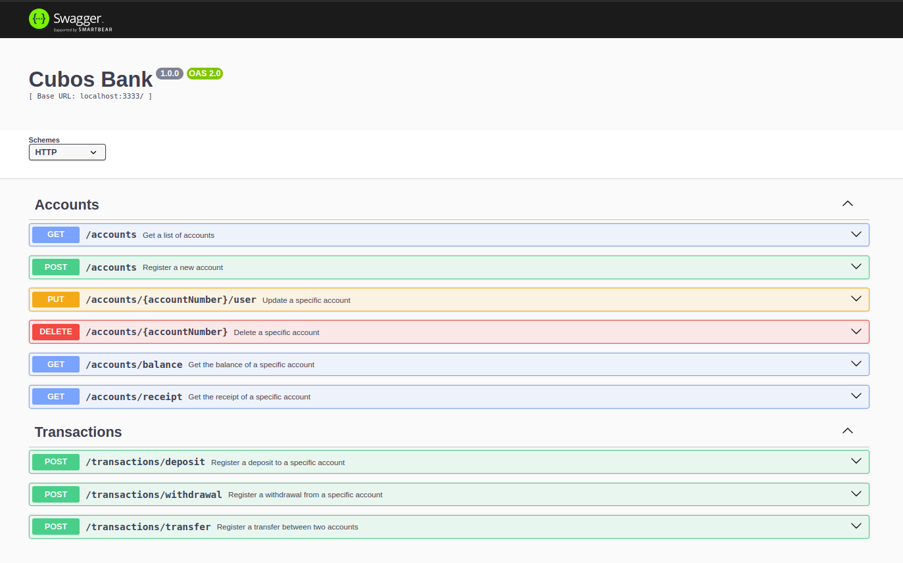

<p align="center">
    
</p>

<p align="center">
  

  
  
  <a href="https://github.com/rafawessling/cubos_bank/commits/main">
    
  </a>

  
</p>

<p align="center">
    
</p>

<p align="center">
    
</p>

> This project consists of developing a RestAPI of a digital bank using _JavaScript, Node.js, and Swagger_.

-   The project is available on this <a href="https://cubos-bank.cyclic.app/doc/" target="_blank">link</a>.

> To get started, register a new account. All CRUD options are available, so it is possible to list, update, and delete accounts. In addition, make transactions, get the balance, and get the receipt.

##

### Index

1. [About the project](#about)
2. [Features](#features)
3. [How to execute](#how-to-execute)
4. [Technologies](#technologies)
5. [Author](#author)
6. [License](#license)

##

<div id='about'></div>

### 1. About the project

This project was developed during the Full Stack Software Development course at <a href="https://github.com/cubos-academy" target="_blank">@cubosacademy</a>.

##

<div id='features'></div>

### 2. Features

-   **Accounts:**
    -   [x] Get all accounts
    -   [x] Register a new account
    -   [x] Update an account
    -   [x] Delete an account
    -   [x] Get the balance
    -   [x] Get the receipt
-   **Transactions:**
    -   [x] Register a deposit
    -   [x] Register a withdrawal
    -   [x] Register a transfer between two accounts

##

<div id='how-to-execute'></div>

### 3. How to execute

-   Firstly, install the following tools: <a href="https://git-scm.com" target="_blank">Git</a>, <a href="https://nodejs.org/en/" target="_blank">Node.js</a>.

-   Clone this repository:

    ```
    $ git clone git@github.com:rafawessling/cubos_bank.git
    ```

-   Access the project folder on the terminal/cmd:
    ```
    $ cd cubos_bank
    ```
-   Install the dependencies:
    ```
    $ npm install
    ```
-   Execute the application:

    ```
    $ npm run dev
    ```

    The server will run on port: 3333 → Access: <a href="http://localhost:3333" target="_blank">http://localhost:3333</a>.

##

<div id='technologies'></div>

### 4. Technologies

In this project, the following technologies are used:

##### Website:

-   JavaScript
-   Node.js
-   Swagger

##### Utility:

-   Git and GitHub
-   Insomnia
-   Editor: Visual Studio Code

##

<div id='author'></div>

### 5. Authors

<a href="https://www.linkedin.com/in/rafaela-wessling/" target="_blank">Rafaela Wessling Oening</a> and <a href="https://www.linkedin.com/in/robsonfelipemir/" target="_blank">Robson Felipe Miranda</a>.

-   **How to contribute to the project:**

1. _Fork_ the project;
2. Create a _new branch_:
    ```
    $ git checkout -b my-feature
    ```
3. Save your changes and _commit_ it:
    ```
    $ git commit -m "feat: Added new feature"
    ```
4. _Submit_:
    ```
    $ git push origin my-feature
    ```

##

<div id='license'></div>

### 6. License

Developed by <a href="https://www.linkedin.com/in/rafaela-wessling/" target="_blank">Rafaela Wessling Oening</a> and <a href="https://www.linkedin.com/in/robsonfelipemir/" target="_blank">Robson Felipe Miranda</a>. Reach out!

##

###### tags: `module 4` `back-end` `JavaScript` `Node.js` `Swagger`
